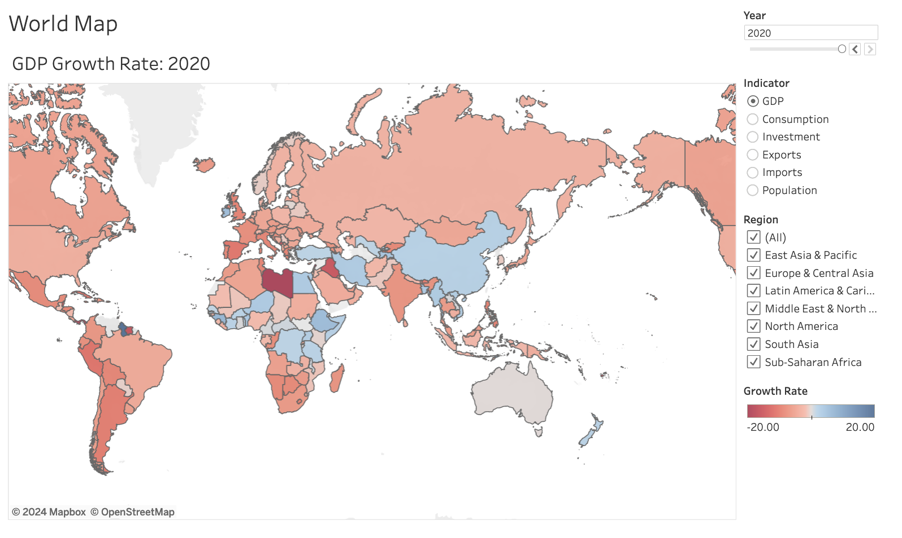

# World Development Indicators
This project studies the World Bank World Development Indicators dataset using SQL and Tableau

### Data
- [World Development Indicators Dataset](https://console.cloud.google.com/marketplace/product/the-world-bank/wdi) (WDI) on Google Cloud

### Notebooks
| Notebook                                    | Description                                                                           |
| ------------------------------------------- | ------------------------------------------------------------------------------------- |
| [Get Codes](./notebooks/01_get_codes.ipynb) | Get list of codes from WDI database.                                                  |
| [Get Data](./notebooks/01_get_data.ipynb)   | Main script to pull data, join core data and country tables, and compute growth rate. |
| [EDA](./notebooks/02_EDA.ipynb)             | Study inequality and the impact of the Global Financial Crisis and Covid-19 Crisis.   |

### Techniques

| Technique                   | Use Case                                                    |
| --------------------------- | ----------------------------------------------------------- |
| JOIN                        | Combine core data and country info tables.                  |
| CASE WHEN statement         | Rename indicators to readable names.                        |
| WINDOW / PARTITION BY / LAG | Compute growth rate.                                        |
| GROUP BY                    | Aggregate data to compute regional and income group tables. |

### [Tableau Dashboard](https://public.tableau.com/app/profile/mitchell.vaughn4481/viz/world-development-indicators/Story1?publish=yes)

### Tools
- SQL - data retrieval and exploratory data analysis
- Tableau - data visualization
